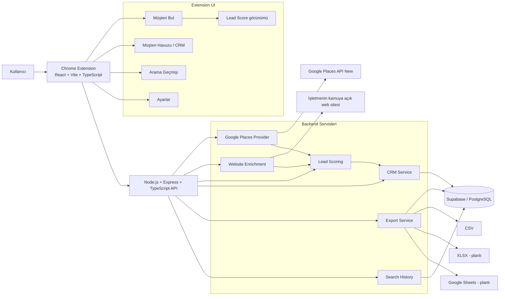
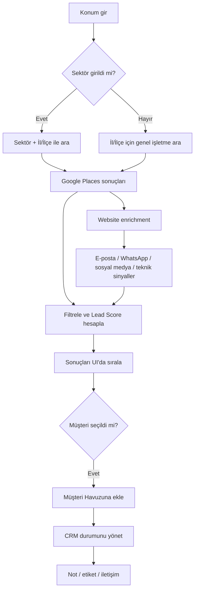

# Google Müşteri Toplama — Proje Mimarisi ve Durum

Bu dosya projenin yaşayan yol haritasıdır. Her geliştirme tamamlandığında ilgili madde işaretlenir.

## Durum göstergeleri
- ✅ Tamamlandı
- 🟡 Devam ediyor
- ⬜ Planlandı

## Mimari

## Kullanıcı akışı

## MVP Kontrol Listesi

### Altyapı
- [x] ✅ Ayrı GitHub repository
- [x] ✅ `codex/mvp-v1` geliştirme branch'i
- [x] ✅ React + Vite + TypeScript extension yapısı
- [x] ✅ Express + TypeScript backend
- [x] ✅ Supabase/PostgreSQL şeması
- [x] ✅ `.env.example` ve secret koruması
- [x] ✅ GitHub Actions CI
- [x] ✅ Typecheck + production build CI'da başarılı

### Müşteri Arama
- [x] ✅ Google Places API (New) bağlantısı
- [x] ✅ İl / ilçe-konum araması
- [x] ✅ Sektör + konum araması
- [x] ✅ Sektörü backend'de opsiyonel yapma
- [ ] 🟡 Sektörü UI'da opsiyonel olarak netleştirme
- [x] ✅ Minimum puan filtresi
- [x] ✅ Minimum yorum filtresi
- [x] ✅ Firma adı
- [x] ✅ Kategori
- [x] ✅ Telefon
- [x] ✅ Website
- [x] ✅ Adres
- [x] ✅ Google Maps bağlantısı
- [x] ✅ Puan / yorum sayısı
- [x] ✅ Place ID
- [x] ✅ Koordinat
- [x] ✅ Çalışma saatleri

### Lead Score
- [x] ✅ 0–100 deterministik skor
- [x] ✅ Skor nedenleri
- [x] ✅ Sıcak / Orta / Düşük görünümü
- [ ] 🟡 Enrichment sinyallerini skora dahil etme
- [ ] ⬜ Kategori bazlı gelişmiş ağırlıklar

### CRM / Müşteri Havuzu
- [x] ✅ Müşteriyi havuza ekleme
- [x] ✅ Place ID duplicate engelleme
- [x] ✅ Havuzda arama
- [x] ✅ Lead Score'a göre sıralama
- [x] ✅ CRM durum değiştirme
- [x] ✅ Durumlar: Yeni / Arandı / WhatsApp / Teklif / Görüşülüyor / Müşteri / Olumsuz
- [ ] 🟡 Not düzenleme UI'sı
- [ ] 🟡 Etiket sistemi UI'sı
- [ ] 🟡 Son iletişim tarihi
- [ ] ⬜ Gelişmiş CRM filtreleri

### Website Enrichment
- [ ] 🟡 Güvenli website fetch servisi
- [ ] 🟡 Kamuya açık e-posta bulma
- [ ] 🟡 WhatsApp bağlantısı bulma
- [ ] 🟡 Instagram bağlantısı bulma
- [ ] 🟡 Facebook bağlantısı bulma
- [ ] 🟡 LinkedIn bağlantısı bulma
- [ ] 🟡 TikTok bağlantısı bulma
- [ ] 🟡 İletişim sayfası bulma
- [ ] 🟡 İletişim formu var/yok
- [ ] 🟡 SSL sinyali
- [ ] 🟡 Mobil uyumluluk sinyali
- [ ] 🟡 WordPress / Wix / Shopify sinyalleri
- [ ] 🟡 SSRF / private-IP / timeout / redirect koruması

### Arama Geçmişi
- [ ] 🟡 Aramaları kaydetme
- [ ] 🟡 Tarih / sektör / konum / filtre bilgisi
- [ ] 🟡 Önceki aramayı tek tıkla tekrar çalıştırma
- [ ] ⬜ Geçmiş aramalarını silme

### Export / Entegrasyon
- [x] ✅ CSV export
- [ ] ⬜ XLSX export
- [ ] ⬜ Kolon seçerek export
- [ ] ⬜ Google Sheets adapter

### UI / UX
- [x] ✅ Türkçe arayüz
- [x] ✅ 460px geniş extension layout
- [x] ✅ Müşteri Bul / Havuz / Geçmiş / Ayarlar navigasyonu
- [x] ✅ Skeleton loading
- [x] ✅ Empty / error / success state'leri
- [x] ✅ Lead Score görünürlüğü
- [x] ✅ Toplu seçim + sticky aksiyon barı
- [x] ✅ CRM durum kontrolü
- [ ] 🟡 Sektör alanını opsiyonel olarak açıklama
- [ ] 🟡 Enrichment durumunu kartlarda gösterme
- [ ] 🟡 Lead detay drawer / detay görünümü
- [ ] 🟡 Son görsel kalite kontrolü

### Güvenlik
- [x] ✅ API anahtarlarını backend env'de tutma
- [x] ✅ Zod input validation
- [x] ✅ Helmet
- [x] ✅ Rate limiting
- [x] ✅ Teknik stack trace'i kullanıcıya göstermeme
- [ ] 🟡 Website enrichment SSRF koruması
- [ ] 🟡 HTML boyut limiti
- [ ] 🟡 HTTP timeout

## Sonraki Faz
- [ ] ⬜ AI kişiselleştirilmiş satış mesajı
- [ ] ⬜ WhatsApp taslağı
- [ ] ⬜ E-posta taslağı
- [ ] ⬜ Periyodik tekrar tarama
- [ ] ⬜ Yeni işletme tespiti
- [ ] ⬜ Doğal dil komutu: “Orhangazi'de web sitesi olmayan işletmeleri bul”
- [ ] ⬜ MCP / agent arayüzü
- [ ] ⬜ Alternatif veri kaynağı provider'ı

## Aktif geliştirme

**Branch:** `codex/mvp-v1`  
**PR:** #2 — MVP v1: Chrome extension + Places API + CRM  
**Ana hedef:** İlk kullanılabilir sürümü stabil, temiz ve satış odaklı hale getirmek.
