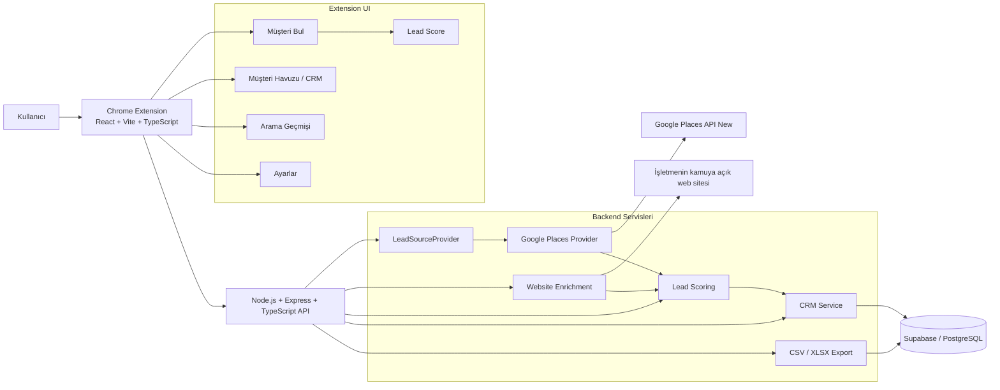
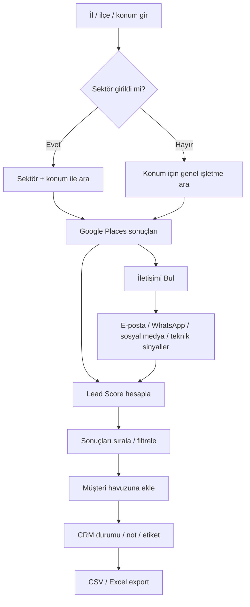

# Google Müşteri Toplama — Proje Mimarisi ve Durum

## 📊 MVP geliştirme durumu: **%100 — Kod + CI tamamlandı**

`████████████████████ 100%`

> Bu yüzde geliştirme kapsamını gösterir. Google API anahtarı, Supabase projesi ve gerçek Chrome ortamıyla yapılacak canlı kabul testleri aşağıda ayrı tutulur.

## Durum göstergeleri
- ✅ Tamamlandı
- 🧪 Canlı kabul testi gerekli
- ⬜ Sonraki faz

## Mimari

## Kullanıcı akışı

# ✅ MVP Kontrol Listesi

## Altyapı
- [x] Ayrı GitHub repository
- [x] `codex/mvp-v1` geliştirme branch'i
- [x] React + Vite + TypeScript Chrome extension
- [x] Express + TypeScript backend
- [x] Supabase / PostgreSQL şeması
- [x] `.env.example` ve secret koruması
- [x] GitHub Actions CI
- [x] LeadSourceProvider abstraction
- [x] Google Places ilk provider

## Müşteri Arama
- [x] İl / ilçe / konum zorunlu
- [x] Sektör isteğe bağlı
- [x] Sektör + konum araması
- [x] Yalnızca konumla genel işletme araması
- [x] Minimum puan filtresi
- [x] Minimum yorum filtresi
- [x] Firma adı
- [x] Kategori
- [x] Telefon
- [x] Website
- [x] Adres
- [x] Google Maps URL
- [x] Puan / yorum sayısı
- [x] Place ID
- [x] Koordinat
- [x] Çalışma saatleri

## Lead Score
- [x] 0–100 deterministik skor
- [x] Türkçe skor nedenleri
- [x] Sıcak / Orta / Düşük görünümü
- [x] Website sinyalleri
- [x] Telefon / e-posta / WhatsApp sinyalleri
- [x] Puan / yorum sinyalleri
- [x] Mobil uyumluluk / iletişim formu sinyalleri
- [x] Sosyal medya eksikliği sinyalleri
- [x] Konservatif kategori ağırlığı
- [x] Unit testler

## CRM / Müşteri Havuzu
- [x] Müşteriyi havuza ekleme
- [x] Place ID duplicate engelleme
- [x] Lead Score'a göre sıralama
- [x] Firma / kategori / e-posta / etiket araması
- [x] CRM durumları
- [x] Durum değiştirme
- [x] Not düzenleme
- [x] Etiket sistemi
- [x] Son iletişim tarihi
- [x] Minimum Lead Score filtresi
- [x] Durum filtresi
- [x] Website var / websitesiz filtresi
- [x] E-posta filtresi
- [x] WhatsApp filtresi
- [x] Instagram filtresi

## Website Enrichment
- [x] Güvenli website fetch servisi
- [x] Kamuya açık e-posta bulma
- [x] WhatsApp bağlantısı bulma
- [x] Instagram bulma
- [x] Facebook bulma
- [x] LinkedIn bulma
- [x] TikTok bulma
- [x] İletişim sayfası bulma
- [x] İletişim formu sinyali
- [x] SSL sinyali
- [x] Mobil viewport sinyali
- [x] WordPress / Wix / Shopify sinyalleri
- [x] SSRF koruması
- [x] Private / loopback IP bloklama
- [x] HTTP timeout
- [x] Redirect limiti
- [x] HTML boyut limiti
- [x] Enrichment başarısızlığında ana lead kaydını koruma

## Arama Geçmişi
- [x] Aramaları kaydetme
- [x] Tarih / sektör / konum / filtre bilgisi
- [x] Sonuç sayısı
- [x] Önceki aramayı tek tıkla tekrar çalıştırma
- [x] Arama geçmişini temizleme

## Export
- [x] CSV export
- [x] XLSX / Excel export

## UI / UX
- [x] Türkçe arayüz
- [x] 460px extension layout
- [x] Müşteri Bul / Havuz / Geçmiş / Ayarlar navigasyonu
- [x] Sektörün isteğe bağlı olduğunu net gösterme
- [x] Zorunlu konum alanını net gösterme
- [x] Skeleton loading
- [x] Empty / error / success state'leri
- [x] Lead Score görünürlüğü
- [x] Toplu seçim + sticky aksiyon barı
- [x] Enrichment durum chip'leri
- [x] Lead detay görünümü
- [x] Skor nedenleri görünümü
- [x] CRM not / etiket düzenleme
- [x] Gelişmiş CRM filtreleri
- [x] CSV + Excel aksiyonları

## Güvenlik / Kalite
- [x] API anahtarlarını backend env'de tutma
- [x] Zod input validation
- [x] Helmet
- [x] Rate limiting
- [x] Teknik stack trace'i kullanıcıya göstermeme
- [x] TypeScript strict
- [x] Typecheck CI'da başarılı
- [x] Unit test CI'da başarılı
- [x] Production build CI'da başarılı
- [x] Chrome extension build artifact CI'da başarılı

# 🧪 Canlı Kabul — geliştirme yüzdesine dahil değil
- [ ] Google Places API (New) anahtarı gerçek ortamda tanımlandı
- [ ] Supabase URL ve service role key tanımlandı
- [ ] `supabase/schema.sql` gerçek Supabase projesinde çalıştırıldı
- [ ] Backend `/health` gerçek ortamda kontrol edildi
- [ ] Sektörlü gerçek arama yapıldı
- [ ] Yalnızca il / ilçe ile gerçek arama yapıldı
- [ ] Müşteri Supabase havuzuna kaydedildi
- [ ] Website enrichment gerçek firma sitesiyle denendi
- [ ] CSV ve Excel export gerçek veriyle indirildi
- [ ] Chrome extension artifact Chrome'da `Load unpacked` ile açıldı
- [ ] Son görsel / kullanım kabulü yapıldı

# ⬜ Sonraki Faz — MVP %100 hesabına dahil değil
- [ ] Google Sheets entegrasyonu
- [ ] Kolon seçerek export
- [ ] AI kişiselleştirilmiş satış mesajı
- [ ] WhatsApp taslağı
- [ ] E-posta taslağı
- [ ] Periyodik tekrar tarama
- [ ] Yeni işletme tespiti
- [ ] Doğal dil komutları
- [ ] MCP / agent arayüzü
- [ ] Alternatif ikinci veri kaynağı provider'ı

## Aktif geliştirme
**Branch:** `codex/mvp-v1`  
**PR:** #2 — MVP v1: Chrome extension + Places API + CRM  
**Durum:** Kod + CI tamamlandı; canlı kabul için gerçek API/Supabase ayarları gerekiyor.
